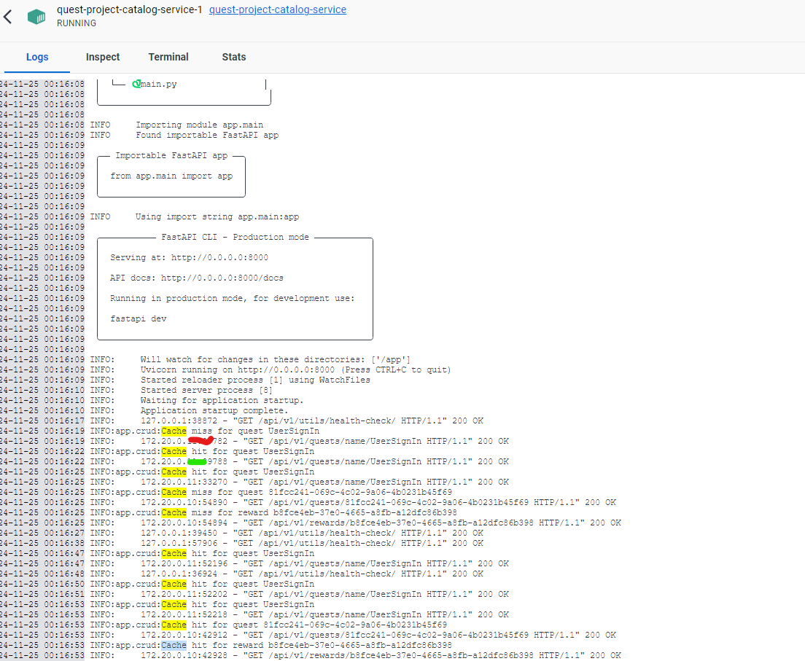

# Quest project

Implement a quest system for users. 

## How to run

```bash
git clone

docker compose up
```

Access the frontend http://localhost:5173/

Login with the default user and password

```
user: user
password: password
```


After Sign in and logout three times check the Event Table on Adminer at http://localhost:8080/ with credentials:

```
system: postgres
server: processing-db
username: postres
password: password
database: app
```


## What I manage to do

- Create microservices (Auth, Quest Catalog, Quest Processing)
- Event Queue for event sourcing
- API gateway and load balancer (traefik proxy)
- Implement an event queue (RabbitMQ)
- Dockerfiles and a dockercompose file to run all containers
- Cache on the Quest Catalog Service (CQRS) 

## What is missing

- Kubernetes configuration
- Implement complete CQRS on the Catalog service


## API `login/access-token`

This API will be called on sign in and it will trigger to send events via event queue to the `processing-service`:

```python
    #Not new user
    if user.status == 1:
        event_in = EventPublish(event_type="UserSignIn", user_id=user.user_id, timestamp=datetime.now(), event_data={})
        await rabbitmq_client.publish(event=event_in,publish_queue="processing-events")

    #New user

    if user.status == 0:
        event_in = EventPublish(event_type="NewUserSignIn", user_id=user.user_id, timestamp=datetime.now(), event_data={})
        await rabbitmq_client.publish(event=event_in,publish_queue="processing-events")
        user_in = UserUpdate(status=1)
        crud.update_user(session=session, db_user=user, user_in=user_in)
```

The `processing-service` will do the following:

- On receiving a `NewUserSignIn` event:
    - Create a UserQuestReward entry
    - Fetch Quest data from the Catalog Service
- On receiving a `UserSignIn` event:
    - Update the UserQuestReward entry
- Check if the quest is completed:
    - Send a `QuestComplete` event to the `auth-service`
- On receiving any event, store it at the `Event` table


From Adminer this is the state of the `Event` table after Sign-in three times:


After 3 sign-in events (1 `NewUserSignin` + 2 `UserSignin`), the `processing-service` emitted a `QuestCompleted` event, after 3 more sign-in events, another `QuestCompleted` event was emitted. As the user reached the duplication limit of this `Quest`, the sign-in events will continue to be registered, but no `QuestCompleted` event will be emitted.

## Flow 

### NewUserSignIn Event - First user login


### UserSignIn Event - On streak completed


## DB diagram


### Auth Service (./auth-service/app/models.py)


### Catalog Service (./catalog-service/app/models.py)


### Processing Service (./processing-service/app/models.py)


## Event Sourcing at `processing-service`

An event queue was created using RabbitMQ, the `auth-service` will publish events of type `NewUserSignin` and `UserSignin`, the `processing-service` will listen to those events and process them accordingly on the service layer (`./processing-service/app/service/events.py`).


I used the same PostgreSQL database to store the `Events` and the `UserQuestRewards` table but it would be better to store the events on a appropriate Event Store like EventStoreDB.


## Caching (CQRS)

The `catalog-service` implements a Redis cache at `./catalog-service/app/crud.ppy` for read queries on the database, the first query will be a miss but any sequential queries will fetch the data from redis cache, as it is shown below when fetching `Reward` and `Quest` data from the DB:



This is not the complete implementation of the `Command and Query Responsibility Segregation` pattern as there is no separation of Commands and Queries, but this is an import part of how to implement CQRS:


## Note

The FastAPI microservices and frontend were based on the [official FastAPI template](https://github.com/fastapi/full-stack-fastapi-template).

The book [Architecture Patterns with Python](https://www.cosmicpython.com/) was used for reference.